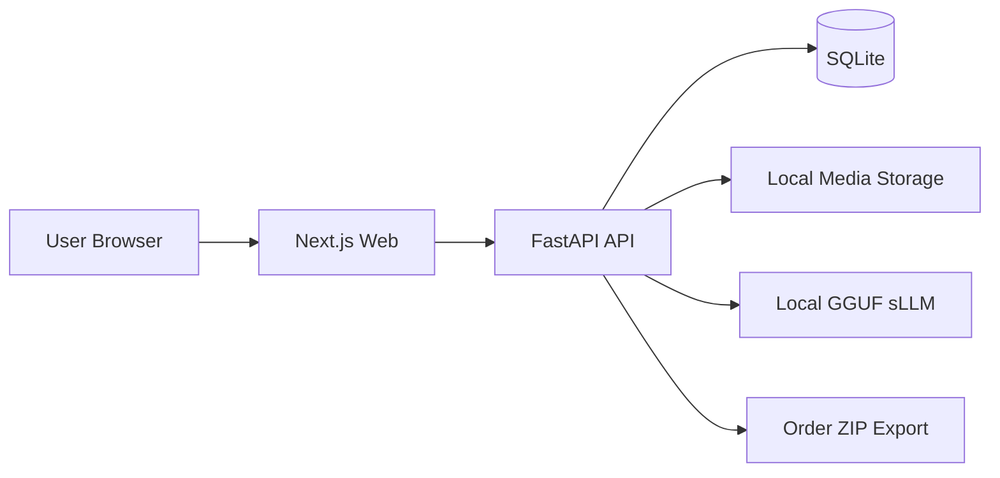

# DreamArchive 과제 보고서 초안

## 1. 서비스 소개

### 어떤 서비스인지 한 문장 설명
꿈 일기를 작성하고, 작성한 꿈 일기를 아카이브로 모아보거나 한 권의 책 초안으로 엮을 수 있는 콘텐츠 서비스입니다.

### 누구를 위한 서비스인지 한 문장 설명
꿈을 자주 꾸지만 금방 내용을 잊어버려 기록으로 남기고 다시 꺼내보고 싶은 사람들을 위한 서비스입니다.

### 서비스 개요
DreamArchive는 "콘텐츠 서비스가 본체이고, 책 만들기는 그 위의 부가 기능"이라는 과제 방향에 맞춰 기획한 서비스입니다. 사용자는 꿈 내용을 기록하고, AI 기반 태그 추천을 받아 정리하고, 나중에 여러 기록을 골라 책 초안으로 묶고 주문 흐름까지 이어갈 수 있습니다.

### 주요 기능 목록
- 꿈 일기 작성, 조회, 수정, 삭제
- 2단계 꿈 작성 플로우(기록 → 정리)
- 수동 태그 입력 + 로컬 sLLM 기반 태그 추천
- 이미지 업로드 및 대표 이미지 표시
- 아카이브 검색: 키워드, 복수 태그, 날짜 범위, 정렬, 페이지네이션
- 카드형/리스트형 아카이브 뷰
- 여러 꿈 일기를 선택해 Book Draft 생성
- Book Draft 순서 변경, 표지 문구/테마 편집, 최종 확정
- 주문 생성, 주문 상태 관리, 주문 수정
- 관리자 페이지에서 주문 확인/제작 상태 관리
- 주문 1건 기준 ZIP(metadata.json + 포함 이미지) export

## 2. 실행 방법 (Docker)

### 기본 실행
```bash
git clone <repo-url>
cd SweetBook_TEST
docker compose up --build
```

### 접속 주소
- Frontend: `http://localhost:3000`
- Backend Docs: `http://localhost:8000/docs`

### 포트 변경 방법
필요하면 `.env.example`를 복사해 `.env`를 만든 뒤 아래 값을 수정하면 됩니다.

```env
WEB_PORT=3000
API_PORT=8000
NEXT_PUBLIC_API_BASE_URL=http://localhost:8000
FRONTEND_ORIGIN=http://localhost:3000
DATABASE_URL=sqlite:////app/data/dreamarchive.db
LLM_CHAT_FORMAT=chatml
LLM_N_CTX=2048
```

### 실행 직후 확인 가능한 내용
- 로그인 없이 바로 서비스 확인 가능
- 시드 데이터 자동 주입
- 꿈 일기, 태그, Book Draft, Order 더미 데이터 포함

### 참고
이 프로젝트는 외부 AI API에 의존하지 않도록 로컬 GGUF 모델을 포함하는 구조로 구성했습니다. 심사자는 `docker compose up --build`만으로 바로 실행할 수 있습니다.

## 3. 완성한 레벨

### 종합 판단
Lv1은 안정적으로 완료했고, Lv2와 Lv3도 기본 흐름은 구현했습니다. 다만 Lv2는 실제 사업 관점의 주문 규칙을 더 고도화할 여지가 있고, Lv3는 이미지 전달 포맷과 파트너 연동 계약을 더 정교하게 설계할 필요가 있습니다.

### Lv1
- 꿈 일기 CRUD 구현
- 태그 기반 아카이브 탐색 구현
- 키워드/날짜/복수 태그 검색 구현
- 이미지 업로드 및 대표 이미지 처리 구현
- 상세 페이지 및 편집 흐름 구현
- 로컬 sLLM 기반 태그 추천 구현

### Lv2
- 여러 꿈 일기를 묶어 Book Draft 생성 가능
- Draft 수정 및 항목 순서 재배치 가능
- Draft 최종 확정 후 주문 생성 가능
- 주문 전 → 주문 확인 중 → 제작 중 → 발송 완료 → 수령 완료 흐름 구현
- 주문 상세에서 수령인, 전화번호, 배송지 입력/확인 가능
- 주문 확인 중 상태에서는 초안 편집 화면으로 돌아가 책 정보/수량/배송정보 수정 가능
- 관리자 페이지에서 주문 확인 및 제작 상태 일괄 변경 가능

### Lv3
- 주문 1건 기준 ZIP export 구현
- ZIP 내부에 `metadata.json`과 실제 포함 이미지 파일을 함께 제공
- 관리자 페이지에서 제작 중 주문을 선택해 메타데이터 추출 테스트 가능
- 주문/제작/수령 흐름과 별개로 관리자 메모, 상태 이력, CSV 내보내기까지 기본 구현

## 4. 기술 스택 및 아키텍처

### 사용한 기술 스택
- Frontend: Next.js 14, React 18, TypeScript, Tailwind CSS, TanStack Query
- Backend: FastAPI, Python 3.11, SQLAlchemy 2.x, Alembic
- DB: SQLite
- AI: `llama-cpp-python` + 로컬 GGUF sLLM
- Infra: Docker Compose

### 왜 이 스택을 선택했는지

#### Frontend: Next.js
과제 기간 안에 화면 구조를 빠르게 만들고, 페이지 단위 라우팅과 데이터 패칭을 명확하게 분리하기에 적합했습니다. App Router 기반으로 아카이브, 작성, Book Draft, Order 화면을 빠르게 구성할 수 있었습니다.

#### Backend: FastAPI
스키마 검증과 API 문서화가 빠르고 명확해 과제형 프로젝트에 적합했습니다. CRUD, 주문 상태 변경, export API처럼 명세가 중요한 기능을 빠르게 구현할 수 있었습니다.

#### DB: SQLite
과제 제출물의 핵심은 "바로 실행되는 재현 가능성"이라고 판단했습니다. 별도 DB 컨테이너 없이도 Docker 한 번으로 동작하게 만드는 것이 중요해서 SQLite를 선택했습니다. 향후 다중 사용자 환경이나 주문 확장성을 고려하면 PostgreSQL 전환을 검토할 수 있습니다.

#### 로컬 sLLM
과제 안내문에서 외부 API 없이 독립 동작하는 서비스가 중요하다고 판단했습니다. 그래서 태그 추천도 외부 LLM API 대신 로컬 GGUF 모델 기반으로 구현했습니다.

### 간단한 아키텍처 다이어그램


### 주요 디렉터리 구조
```text
root/
  apps/
    api/
      app/
        api/routes/
        models/
        schemas/
        services/
    web/
      app/
      components/
      lib/
  models/
  scripts/
  docker-compose.yml
  docker-compose.debug.yml
  README.md
```

## 5. AI 도구 사용 내역

| 도구 | 사용 목적 | 활용 내용 |
| --- | --- | --- |
| ChatGPT | 기획 및 문서화 | 서비스 방향 구체화, MVP 범위 정리, 프롬프트 문장 정리 |
| Codex | 구현 및 구조 설계 | 전체 아키텍처 정리, FastAPI/Next.js 연결, 더미 데이터/라우트 보완 |
| Claude Code | 기능 고도화 | 세부 기능 보강, 화면 흐름 정리, 일부 구현 대안 탐색 |
| Nano Banana2 | 시각 자료 보조 | 더미 데이터용 이미지 생성 |
| Stitch | 디자인 초안 | 초기 화면 레이아웃 아이디어 확보 |
| Claude Design | 디자인 고도화 | 아카이브 페이지와 카드 UI 다듬기 |

### 별도 명시할 점
- 서비스 런타임에서 OpenAI API, Claude API 같은 외부 생성형 AI API는 사용하지 않았습니다.
- 실제 태그 추천 기능은 로컬 모델 기반으로 동작합니다.

## 6. 왜 이 서비스 아이디어를 선택했는지
꿈은 내용이 강렬해도 금방 잊히는 콘텐츠라서 "기록하고 다시 꺼내본다"는 흐름이 분명합니다. 또한 꿈 기록은 감정, 상징, 관계 같은 태그 체계와 잘 맞고, 여러 기록을 모아 하나의 책으로 엮는 확장도 자연스럽습니다. 과제의 핵심 조건인 "콘텐츠 서비스가 본체, 책은 부가 기능" 구조와 잘 맞는다고 판단해 이 아이디어를 선택했습니다.

## 7. 이 서비스의 사업적 가능성
- 기록형 서비스는 사용 습관이 생기면 재방문 가능성이 높습니다.
- 꿈은 개인적인 콘텐츠라 축적 가치가 크고, 시간이 지날수록 책으로 묶는 의미도 커집니다.
- AI 태그 추천과 아카이브 탐색이 붙으면 단순 메모가 아니라 "개인 감정/상징 데이터베이스"로 발전할 수 있습니다.
- 장기적으로는 월간 리포트, 연간 꿈 통계, 기념일용 주문, 선물용 소량 제작 같은 확장 가능성이 있습니다.

동시에 개인정보와 사적인 서사에 대한 민감도가 높기 때문에, 사업화 단계에서는 권한 관리와 데이터 보호가 매우 중요하다고 봅니다.

## 8. 더 시간이 있었다면 추가했을 기능
- 회원 기능 및 개인별 아카이브 분리
- 태그 통계 대시보드와 감정 변화 시각화
- 꿈 일기 작성 시 실시간 AI 요약/연관 태그 제안 개선
- Book Draft 미리보기 고도화
- 관리자 페이지의 주문 상세/통계 고도화
- 이미지 ZIP export를 다중 주문 아카이브 ZIP으로 확장
- SQLite에서 PostgreSQL로 전환하고 다중 사용자 환경 대응

## 9. 서비스 기획 의도와 과정
처음에는 "꿈을 책으로 만드는 서비스"를 먼저 떠올렸지만, 과제 안내문을 읽고 책 제작을 본체로 두면 과제 의도와 어긋난다고 판단했습니다. 그래서 구조를 "꿈 기록 -> 아카이브 탐색 -> 큐레이션(Book Draft) -> 주문" 순서로 다시 설계했습니다.

이 과정에서 가장 먼저 정한 것은 Lv1의 완성도를 우선하는 것이었습니다. 꿈 일기 작성과 조회, 아카이브 탐색이 자연스럽게 연결되지 않으면 Lv2와 Lv3를 붙여도 서비스로 느껴지지 않는다고 봤습니다. 이후 Book Draft를 별도 개념으로 둬서, 바로 주문으로 가는 것이 아니라 사용자가 콘텐츠를 한 번 더 고르는 편집 단계가 있도록 설계했습니다.

## 10. 구체적인 과제 수행 과정
1. 과제 요구사항을 읽고 "콘텐츠 서비스 우선"이라는 기준을 먼저 정리했습니다.
2. 서비스 주제를 꿈 일기로 정한 뒤, 핵심 플로우를 꿈 기록, 태그 분류, 아카이브 탐색으로 좁혔습니다.
3. Next.js와 FastAPI, SQLite, Docker Compose를 기준으로 초기 골격을 먼저 만들었습니다.
4. DreamEntry, Tag, BookDraft, Order 순으로 데이터 모델을 나누고, CRUD와 상태 흐름을 붙였습니다.
5. 외부 API 의존을 줄이기 위해 로컬 GGUF 모델 기반 태그 추천을 붙였습니다.
6. 심사자가 바로 확인할 수 있도록 시드 데이터, 실행 스크립트, Docker 실행 구조를 정리했습니다.
7. 마지막에는 아카이브 UI와 검색 경험, 카드 디자인, 디버그 편의성 같은 사용성 영역을 집중적으로 다듬었습니다.

## 11. 과제에서 내린 가장 중요한 판단
가장 중요한 판단은 "책 만들기 기능을 본체로 두지 않고, 꿈 기록과 탐색 경험을 중심에 둔다"는 것이었습니다. 이 판단 덕분에 기능 우선순위가 명확해졌고, DreamEntry -> BookDraft -> Order로 이어지는 데이터 흐름도 자연스럽게 정리할 수 있었습니다.

기술적으로는 외부 AI API 대신 로컬 모델과 SQLite를 선택한 것도 중요한 판단이었습니다. 심사자가 별도 키나 외부 서비스 설정 없이 바로 실행할 수 있어야 과제의 재현성과 완성도가 높아진다고 봤기 때문입니다.

## 12. AI 도구 사용 중 겪은 실패 또는 문제
AI 도구를 적극적으로 쓰면서 가장 크게 느낀 문제는 "그럴듯하지만 현재 코드나 요구사항과 어긋나는 제안"이 자주 나온다는 점이었습니다.

- UI 제안은 시각적으로는 그럴듯했지만 실제 데이터 구조에 없는 필드를 암묵적으로 전제하는 경우가 있었습니다.
- 과제 요구사항보다 과한 방향으로 확장해 결제, 복잡한 주문 처리, 고급 추천 기능까지 가정하는 경우가 있어 계속 범위를 다시 좁혀야 했습니다.
- 로컬 LLM 태그 생성도 출력 형식이 흔들리거나 허용되지 않은 태그를 내놓는 문제가 있어, 허용 태그 집합을 제한하고 후처리 검증 로직을 추가해야 했습니다.

결국 AI를 많이 쓰더라도, 최종적으로는 "이 기능이 지금 스키마와 요구사항에 맞는가", "심사자가 바로 실행 가능한가", "범위가 과제에 비해 과하지 않은가"를 사람이 계속 판단해야 한다는 점을 배웠습니다.

## 13. 면접/제출용 한 줄 요약
DreamArchive는 꿈 기록과 아카이브 탐색을 중심으로 설계한 콘텐츠 서비스이며, 그 기록을 Book Draft와 주문 기능으로 확장해 "콘텐츠 본체 + 책 만들기 부가 기능" 구조를 구현한 과제 결과물입니다.
