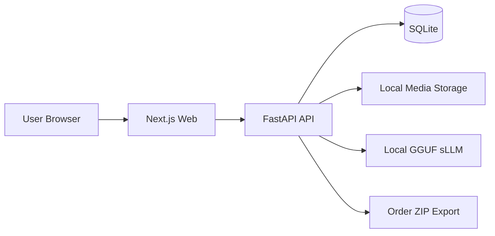

# Dream Archive

## 1. 서비스 소개
꿈 일기를 작성하고, 작성한 꿈 일기를 모아보거나 책으로 엮을 수 있는 콘텐츠 서비스입니다.

### 누구를 위한 서비스인가요?
꿈을 자주 꾸지만 금방 내용을 잊어버려 기록으로 남기고 다시 찾아보고 싶은 사람들을 위한 서비스입니다.

### 어떤 기능이 있나요?
- 꿈 일기 작성하고, 태그와 이미지를 추가할 수 있습니다.
- 작성한 꿈 일기를 검색하고, 다시볼 수 있습니다.
- 로컬 LLM이 일기 내용을 바탕으로 적절한 태그를 추천합니다.
- 여러 꿈 일기를 묶어서 책을 주문할 수 있습니다.
- 내가 주문한 책의 정보를 수정하거나 제작 진행상황을 확인할 수 있습니다.
- 관리자 페이지에서 주문 정보 확인, 주문 접수, 메타데이터 추출, 주문 통계 등을 확인할 수 있습니다.

## 2. 실행 방법 (Docker)
### Linux (Ubuntu 22.04) 환경을 기준으로 작성되었습니다.
#### 필수 설치 확인
```bash
git --version
git lfs version
docker version
docker compose version
```
하나라도 없다면 아래에서 다운로드
- Docker Engine: https://docs.docker.com/engine/install/ubuntu/
- Docker Compose plugin: https://docs.docker.com/compose/install/linux/
- Git LFS: https://git-lfs.com/


```bash
#저장소 클론
git clone https://github.com/J-han2/SweetBook_TEST.git
cd SweetBook_TEST

#LLM 모델 다운로드(시간이 조금 소요될 수 있습니다)
git lfs install
git lfs pull


#모델 확인
ls models


#환경 변수 생성
cp .env.example .env


#실행
docker compose up -d

```

#### 포트 수정이 필요한 경우
포트를 바꾸려면 .env 파일의 값을 수정합니다.
```bash
#예시 : 프론트 3100, 백엔드 8100
WEB_PORT=3100
API_PORT=8100
FRONTEND_ORIGIN=http://localhost:3100
INTERNAL_API_BASE_URL=http://api:8100
```

포트를 변경한 경우 Docker 컨테이너를 재실행 해주세요
```bash
docker compose down
docker compose up -d
```

아래 주소에서 서비스를 확인할 수 있습니다.
- 서비스 : `http://localhost:3000`
- Docs : `http://localhost:8000/docs`


## 3. 완성한 레벨
### Lv1
- 꿈 일기 CRUD를 구현했습니다.
- 태그/키워드/날짜 필터 기반 DB 검색 기능을 구현했습니다.
- 로컬 sLLM 모델 기반 태그 추천 기능을 구현했습니다.

### Lv2
- 여러 꿈 일기를 묶어 책을 주문할 수 있는 기능을 구현했습니다.
- 주문 전 → 주문 확인 중 → 제작 중 → 발송 완료 → 수령 완료로 주문 상태를 나누어 각 상태별로 할 수 있는 기능을 제한했습니다.
- 관리자 페이지를 별도로 두어 책의 주문 흐름을 사용자와 관리자 관점에서 구분하여 확인할 수 있도록  구현했습니다.
- 관리자 페이지에서 주문 현황에 대한 통계 및 시각화를 확인할 수 있도록 구현했습니다.

### Lv3
- 관리자 페이지에서 선택한 주문에 대해 책 제작에 필요한 데이터(json 메타데이터 + 이미지 파일)를 추출할 수 있도록 구현했습니다.

## 4. 기술 스택 및 아키텍처

### 사용한 기술 스택
- Frontend: Next.js, Tailwind CSS
- Backend: FastAPI
- DB: SQLite
- AI: `llama-cpp-python` + Qwen2.5-0.5b-q4 양자화 모델
- Infra: Docker Compose

### 스택을 선택한 이유는?

#### Frontend: Next.js
바이브 코딩 환경에서 화면 구조를 빠르게 파악하고, 페이지 단위 라우팅과 데이터 패칭을 명확하게 분리하기에 적합하여 선택했습니다.

#### Backend: FastAPI
프로젝트의 성격상 API 설계 역량을 보여드리는 것이 중요하다고 생각되어, API 문서화가 빠르고 명확한 FastAPI를 선택했습니다.

#### DB: SQLite
구현의 용이함과 독립성이 강한 SQLite의 특징이 프로젝트의 성격와 맞다고 판단하여 선택했습니다. 향후 다중 사용자 환경이나 주문 확장성을 고려하면 PostgreSQL 전환을 검토할 수 있습니다.

#### `llama-cpp-python` + Qwen2.5-0.5b-q4 양자화 모델
외부 AI API에 의존하지 않고 로컬 환경에서 AI 기능을 제공하기 위해 llama-cpp-python을 사용했습니다. Qwen2.5-0.5B 모델의 4-bit 양자화 버전을 사용해 제한된 환경에서도 비교적 가볍게 추론할 수 있도록 구성했습니다.

### 간단한 아키텍처 다이어그램


### 주요 디렉터리 구조
```text
root/
  apps/
    api/
      app/
        api/routes/
        models/
        schemas/
        services/
    web/
      app/
      components/
      lib/
  models/
  scripts/
  docker-compose.yml
  README.md
```

## 5. AI 도구 사용 내역

| 도구 | 사용 목적 | 활용 내용 |
| --- | --- | --- |
| Claude | 초기 기획 | 서비스 요구사항을 기획서 형태로 구조화 |
| ChatGPT | 프롬프트 설계 | 기획서를 Codex용 영어 프롬프트로 변환하고 조건 정리 |
| Codex | 서비스 구현 | Next.js, FastAPI, SQLite, 로컬 AI 서빙 구조 구현 및 디버깅 |
| Claude Code | 구현 보조 | 일부 기능 개선 및 구현 대안 탐색 |
| Stitch | 디자인 초안 | 레퍼런스 기반 초기 UI 레이아웃 구성 |
| Claude Design | 디자인 고도화 | 주요 화면의 카드 UI와 아카이브 화면 개선 |
| Nano Banana 2 / Midjourney / GPT Image 2 | 이미지 생성 | 더미 데이터용 이미지 리소스 생성 |
| Qwen2.5-0.5B + llama-cpp-python | 로컬 AI | 외부 API 없이 태그 생성 모델을 로컬에서 서빙 |

### 외부 의존성 제외
- 서비스 런타임에서 OpenAI API, Claude API 같은 외부 생성형 AI API는 사용하지 않았습니다.
- 실제 태그 추천 기능은 로컬 모델 기반으로 동작합니다.

## 6. 설계 의도

### 왜 이 서비스 아이디어를 선택했나요?
꿈은 내용이 강렬해도 금방 잊히는 콘텐츠라서 "기록하고 다시 꺼내본다"는 흐름이 분명합니다. 또한 꿈 기록은 감정, 상징, 관계 같은 태그 체계와 잘 맞고, 여러 기록을 모아 하나의 책으로 엮는 확장도 자연스럽습니다. 과제의 핵심 조건인 "콘텐츠 서비스가 본체, 책은 부가 기능" 구조와 잘 맞는다고 판단해 이 아이디어를 선택했습니다.

### 이 서비스의 사업적 가능성은?
- 기록형 서비스는 사용 습관이 생기면 재방문 가능성이 높습니다.
- 꿈은 개인적인 콘텐츠라 축적 가치가 크고, 시간이 지날수록 책으로 묶는 의미도 커집니다.
- AI 태그 추천과 아카이브 탐색이 붙으면 단순 메모가 아니라 "개인 감정/상징 데이터베이스"로 발전할 수 있습니다.
- 장기적으로는 월간 리포트, 연간 꿈 통계, 기념일용 주문, 선물용 소량 제작 같은 확장 가능성이 있습니다.

동시에 개인정보와 사적인 서사에 대한 민감도가 높기 때문에, 사업화 단계에서는 권한 관리와 데이터 보호가 매우 중요하다고 봅니다.

### 8. 더 시간이 있었다면 추가하고 싶은 기능이 있다면?
- SQLite에서 PostgreSQL로 전환하고 다중 사용자에도 대응할 수 있는 구조로 전환
- 태그 추론 모델 파인튜닝
- 책 미리보기 기능 고도화

## 9. 서비스 기획 의도와 과정
처음에는 "꿈을 책으로 만드는 서비스"를 먼저 떠올렸지만, 과제 안내문을 읽고 책 제작을 본체로 두면 과제 의도와 어긋난다고 판단했습니다. 그래서 구조를 "꿈 기록 -> 아카이브 탐색 -> 큐레이션(Book Draft) -> 주문" 순서로 다시 설계했습니다.

이 과정에서 가장 먼저 정한 것은 Lv1의 완성도를 우선하는 것이었습니다. 꿈 일기 작성과 조회, 아카이브 탐색이 자연스럽게 연결되지 않으면 Lv2와 Lv3를 붙여도 서비스로 느껴지지 않는다고 봤습니다. 이후 Book Draft를 별도 개념으로 둬서, 바로 주문으로 가는 것이 아니라 사용자가 콘텐츠를 한 번 더 고르는 편집 단계가 있도록 설계했습니다.
